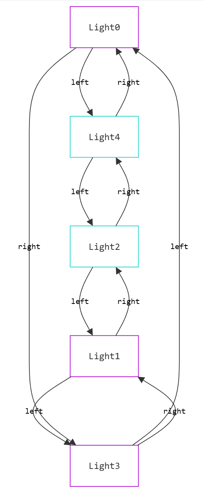
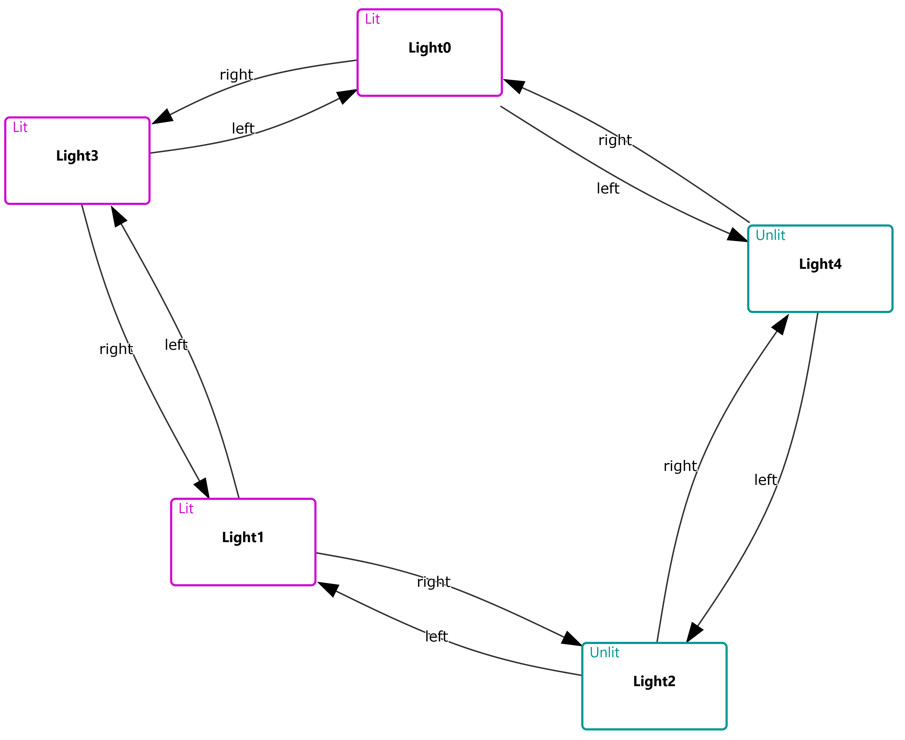

# Constraints
Constraints define spatial relationships between elements in the diagram. Each constraint consists of a **type** and associated **parameters**.

## **Cyclic Constraints**
Cyclic constraints arranges elements related by a field in a circular layout.


```yaml
constraints:
  - cyclic:
      field: next
      direction: clockwise  
      appliesTo: [Node, Node]
``` 


<!-- |  | ```
constraints:
  - cyclic:
      field: left
      direction: clockwise  
      appliesTo: [Node, Node]
``` |  |
|------------------------------------|-----------------------------------------|-------------------------------------| -->


#### Parameters

- `field` : Name of the field in the source specification upon which the constraint acts
- `direction` : [Optional] Direction in which elements will be laid out. One of `clockwise` or `counterclockwise`. Defaults to `clockwise`
- `appliesTo` : [Optional] List of the form [`sourceSig`, `targetSig`] , describing output graph edges to which this constraint applies. Defaults to [`univ`, `univ`] (that is, all types).


## **Orientation Constraints**
Specify the relative positioning of elements.

### Orientation for Fields

```yaml
constraints:
  - orientation:
      field: next
      directions: [left, below]  # Multiple allowed
```

#### Parameters

- `field` : Name of the field in the source specification upon which the constraint acts.
- `directions` : Directions in which elements will be laid out. List of directions, which can be
                `left`, `right`, `above`, `below`, `directlyAbove`, `directlyBelow`, `directlyLeft`, `directlyRight`.

- `appliesTo` : [Optional] List of the form [`sourceSig`, `targetSig`] , describing output graph edges to which this constraint applies. Defaults to [`univ`, `univ`] (that is, all types).

### Orientation for Sigs

Alternatively, orientation can apply to entire sigs, defining constraints between all atoms of certain sig types.

```yaml
constraints:
  - orientation:
      sigs: [A, B]
      directions: [above]
```


#### Parameters

- `sigs` : List of sig names the source specification upon which the constraint acts. This list can have exactly 2 elements.
- `directions` : Directions in which elements will be laid out. List of directions, which can be
                `left`, `right`, `above`, `below`, `directlyAbove`, `directlyBelow`, `directlyLeft`, `directlyRight`.


## **Grouping Constraints**
Group elements together based on a field.

```yaml
constraints:
  - group:
      field: category
      target: domain  # or range
```

#### Parameters

- `field` : Name of the field in the source specification upon which the constraint acts.
- `target` : [Optional] Which part of the field relation is grouped *upon*. Can be `range`  or `domain`. Default is `range`.


# When Constraints Cannot Be Satisfied

All CnD constraints are **hard constraints**, and thus must be satisfied for a diagram to be produced. Constraints might not be satisfied for one of two reasons:

**A single CnD constraint definition could be inherently unsatisfiable.** For example, a constraint on the `next` field that requires the same field to be laid out both leftwards and rightwards:

```yaml
- orientation:
    field: next
    directions: [right, left]
```

This represents a bug in the CnD spec, and can be identified statically. In this case, CnD produces an error message in terms of the constraints that could not be satisfied:

```
Error: Inconsistent orientation constraint:
Field `next` cannot be laid out with directions: right, left.
```


**Some constraints may be individually satisfiable, but become contradictory when laying out a specific instance.** This is akin to a dynamic error, as it depends on the structure of the instance being visualized. For example, consider the constraints:

```yaml
- orientation:
    sigs: [X, Y]
    directions: [below]
- orientation:
    sigs: [Y, Z]
    directions: [below]
- orientation:
    sigs: [Z, X]
    directions: [below]
```
If an instance’s elements form a cyclic dependency, the constraints become unsatisfiable. However, an instance may lack atoms of, say, `Z`, in which case the constraints are satisfiable.


In both these cases, CnD **does not produce a diagram**. Instead, it provides an error message explaining that the constraints could not be met. 
